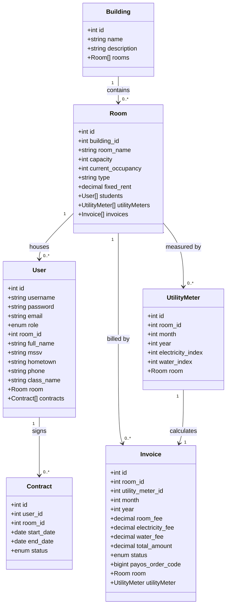
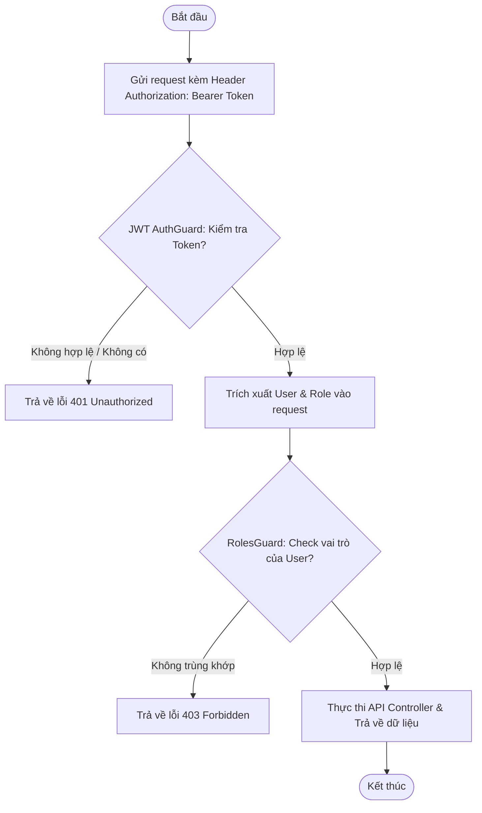
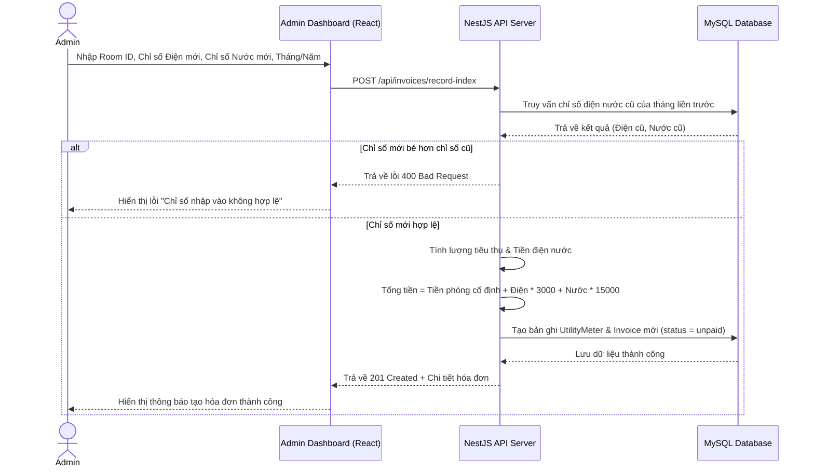
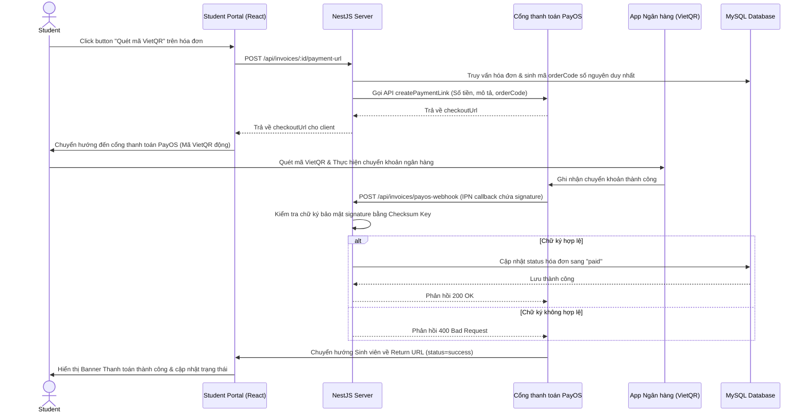
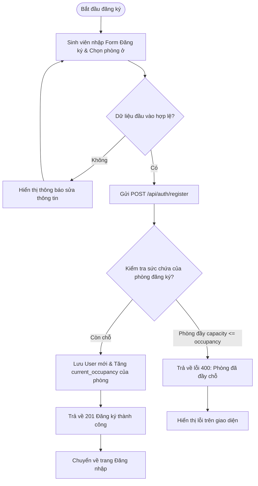
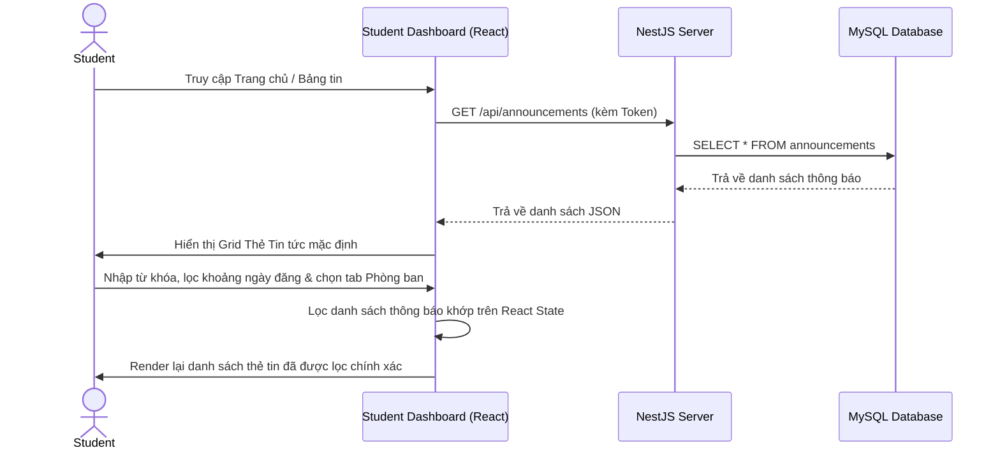

# BÁO CÁO BÀI TẬP LỚN: HỆ THỐNG QUẢN LÝ KÝ TÚC XÁ
**Môn học:** Lập trình Web Nâng Cao
**Trường:** Đại Học Phenikaa
**Vai trò sinh viên thực hiện:** SV1 — Trần Thị Quỳnh (Trưởng nhóm) — Core Auth, Phân quyền & Quản lý Tài chính – Hóa đơn

---

## CÂU 1: CÂU CHUYỆN NGƯỜI DÙNG (USER STORIES)

Dưới đây là danh sách các Câu chuyện người dùng (User Stories) được thiết kế cho hệ thống Quản lý Ký túc xá, tập trung vào phạm vi của Trưởng nhóm (SV1) và các mối liên kết toàn hệ thống:

### 1. Phân hệ Xác thực & Phân quyền (Auth & Users)
* **Đăng ký tài khoản Sinh viên:**
  * *Là* một sinh viên mới vào ký túc xá,
  * *Tôi muốn* đăng ký tài khoản trực tuyến bằng cách điền đầy đủ các thông tin cá nhân (Họ tên, SĐT, MSSV, Lớp, Quê quán) và chọn phòng ở được phân bổ,
  * *Để* tôi có thông tin đăng nhập chính thức vào hệ thống quản lý cư trú.
* **Đăng nhập hệ thống:**
  * *Là* một người dùng (Sinh viên hoặc Admin),
  * *Tôi muốn* nhập tên tài khoản và mật khẩu của mình tại trang đăng nhập,
  * *Để* tôi có thể truy cập vào các tính năng tương ứng với vai trò của mình.
* **Phân quyền truy cập (RolesGuard):**
  * *Là* một sinh viên,
  * *Tôi muốn* hệ thống tự động ngăn chặn và bảo vệ các đường dẫn quản trị (Admin routes),
  * *Để* đảm bảo thông tin nội bộ của ban quản lý ký túc xá không bị xâm nhập trái phép.

### 2. Phân hệ Tài chính & Hóa đơn (Billing - Tích hợp PayOS)
* **Ghi nhận số điện nước tiêu thụ (Admin):**
  * *Là* một quản trị viên ký túc xá,
  * *Tôi muốn* nhập chỉ số điện và nước tiêu thụ cuối tháng cho từng phòng,
  * *Để* hệ thống tự động tính toán tổng số tiền phòng và các dịch vụ đi kèm.
* **Tự động tính hóa đơn:**
  * *Là* một quản trị viên,
  * *Tôi muốn* hệ thống áp dụng công thức chuẩn: `Tổng tiền = Phòng cố định + (Số điện * 3.000đ) + (Số nước * 15.000đ)` và tự tạo hóa đơn trạng thái "Chưa thanh toán" (unpaid),
  * *Để* giảm thiểu sai sót tính toán thủ công bằng Excel.
* **Xem lịch sử hóa đơn phòng mình (Sinh viên):**
  * *Là* một sinh viên nội trú,
  * *Tôi muốn* xem danh sách các hóa đơn điện nước hàng tháng và lịch sử giao dịch của phòng mình,
  * *Để* tôi nắm bắt được các khoản phí cần hoàn thành.
* **Thanh toán VietQR động (PayOS):**
  * *Là* một sinh viên nội trú,
  * *Tôi muốn* bấm nút "Thanh toán PayOS" để tạo mã VietQR động chứa đúng số tiền cần đóng,
  * *Để* tôi quét mã thanh toán chuyển khoản qua app ngân hàng cực kỳ nhanh chóng mà không cần nhập thủ công số tài khoản hay số tiền.
* **Webhook tự động đối soát hóa đơn:**
  * *Là* một sinh viên,
  * *Tôi muốn* sau khi tôi quét mã QR chuyển tiền thành công, hệ thống tự động cập nhật trạng thái hóa đơn sang "Đã thanh toán" (paid) ngay lập tức,
  * *Để* tôi không phải chụp màn hình biên lai gửi cho quản lý phòng duyệt thủ công.

---

## CÂU 2: PHÂN TÍCH YÊU CẦU, ĐỐI TƯỢNG, MỐI QUAN HỆ & PHƯƠNG THỨC HOẠT ĐỘNG

Dựa trên đề tài Quản lý Ký túc xá, hệ thống được phân tích thành các thực thể quan hệ chính sau:

### 1. Đối tượng và các Thuộc tính
* **Tòa nhà (Building):**
  * *Thuộc tính:* `id` (Khóa chính), `name` (Tên tòa), `description` (Mô tả).
* **Phòng ở (Room):**
  * *Thuộc tính:* `id` (Khóa chính), `building_id` (Khóa ngoại), `room_name` (Tên phòng), `capacity` (Sức chứa tối đa), `current_occupancy` (Số người hiện tại), `type` (Loại phòng), `fixed_rent` (Giá thuê cố định).
* **Người dùng (User / Student):**
  * *Thuộc tính:* `id` (Khóa chính), `username` (Tên đăng nhập), `password` (Mật khẩu đã băm), `email` (Địa chỉ email), `role` (Vai trò: admin/student), `room_id` (Khóa ngoại phòng ở), `full_name` (Họ tên), `mssv` (Mã sinh viên), `hometown` (Quê quán), `phone` (SĐT), `class_name` (Lớp học).
* **Hợp đồng cư trú (Contract):**
  * *Thuộc tính:* `id` (Khóa chính), `user_id` (Khóa ngoại), `room_id` (Khóa ngoại), `start_date` (Ngày bắt đầu), `end_date` (Ngày kết thúc), `status` (active/expired).
* **Chỉ số Điện Nước (UtilityMeter):**
  * *Thuộc tính:* `id` (Khóa chính), `room_id` (Khóa ngoại), `month` (Tháng), `year` (Năm), `electricity_index` (Chỉ số điện mới), `water_index` (Chỉ số nước mới).
* **Hóa đơn tài chính (Invoice):**
  * *Thuộc tính:* `id` (Khóa chính), `room_id` (Khóa ngoại), `utility_meter_id` (Khóa ngoại), `month` (Tháng), `year` (Năm), `room_fee` (Tiền phòng cố định), `electricity_fee` (Tiền điện tiêu thụ), `water_fee` (Tiền nước tiêu thụ), `total_amount` (Tổng cộng), `status` (unpaid/paid), `payos_order_code` (Mã đơn hàng PayOS).
* **Bảng tin thông báo (Announcement):**
  * *Thuộc tính:* `id` (Khóa chính), `title` (Tiêu đề), `content` (Nội dung), `created_at` (Ngày đăng).

### 2. Mối quan hệ giữa các đối tượng (Entity Relationships)
* **Building 1 - N Room:** Một tòa nhà có nhiều phòng ở.
* **Room 1 - N User:** Một phòng ở chứa tối đa N sinh viên (dựa theo sức chứa `capacity`).
* **User 1 - N Contract:** Một sinh viên có thể có nhiều hợp đồng cư trú qua các năm học, nhưng tại một thời điểm chỉ có 1 hợp đồng `active`.
* **Room 1 - N UtilityMeter:** Một phòng ở có nhiều bản ghi đo chỉ số điện nước theo từng tháng.
* **Room 1 - N Invoice:** Một phòng có nhiều hóa đơn hàng tháng.
* **UtilityMeter 1 - 1 Invoice:** Một chỉ số đo điện nước tháng tương ứng trực tiếp với một hóa đơn thanh toán tháng đó.

### 3. Phương thức hoạt động (Methods)
* **AuthService:** `register(dto)`, `login(dto)`, `getProfile(userId)`.
* **RoomsService:** `findAll()`, `findOne(id)`, `create(dto)`.
* **InvoicesService:** 
  * `recordUsageAndCreateInvoice(dto)`: Ghi nhận chỉ số điện nước mới, tính toán tiền theo công thức đơn giá định sẵn và tạo hóa đơn unpaid.
  * `findAll(role, roomId)`: Trích xuất danh sách hóa đơn (admin xem toàn bộ, student chỉ xem hóa đơn của phòng mình).
  * `createPayosPaymentUrl(invoiceId)`: Tạo liên kết thanh toán VietQR động từ cổng thanh toán PayOS.
  * `handlePayosWebhook(body)`: Nhận thông báo giao dịch thành công tự động từ PayOS gửi về để cập nhật trạng thái hóa đơn sang `paid`.
* **AnnouncementsController:** `getAnnouncements()`, `createAnnouncement(dto)`.

---

## CÂU 3: SƠ ĐỒ CẤU TRÚC LỚP (CLASS DIAGRAM) & SƠ ĐỒ THUẬT TOÁN (5 SƠ ĐỒ ACTIVITY/SEQUENCE)

### 1. Sơ đồ Cấu trúc Lớp (UML Class Diagram)

### 2. Sơ đồ 1: Quy trình Xác thực & Phân quyền (Activity Diagram)
Mô tả luồng người dùng truy cập tài nguyên bảo mật được kiểm soát bởi JWT Guard và RolesGuard.

### 3. Sơ đồ 2: Ghi nhận Chỉ số Điện Nước & Tự động tạo Hóa đơn (Sequence Diagram)
Mô tả thao tác của Admin khi chốt số điện nước hàng tháng cho phòng.

### 4. Sơ đồ 3: Quy trình Thanh toán PayOS VietQR (Sequence Diagram)
Mô tả luồng giao dịch trực tuyến từ lúc sinh mã QR đến lúc Webhook IPN cập nhật hóa đơn.

### 5. Sơ đồ 4: Đăng ký tài khoản và Kiểm tra phòng trống (Activity Diagram)
Quy trình đảm bảo sinh viên đăng ký đúng phòng còn chỗ.

### 6. Sơ đồ 5: Đọc Bảng tin thông báo & Tìm kiếm bộ lọc (Sequence Diagram)
Quy trình trích xuất và lọc thông báo tại Trang chủ theo bố cục mới.

---

## CÂU 4: THỰC HIỆN API CRUD VÀ XỬ LÝ CÁC THAO TÁC NGHIỆP VỤ (BACKEND NESTJS)

Dự án Backend sử dụng mô hình phân lớp chuẩn của **NestJS**:
* **Lớp Controller:** Chịu trách nhiệm định tuyến, nhận HTTP Request, áp dụng các Guards để xác thực và trả về dữ liệu.
* **Lớp Service (Nghiệp vụ):** Nơi xử lý toàn bộ logic tính toán tiền điện nước, băm mật khẩu, sinh link PayOS, kiểm tra dữ liệu.
* **Lớp Repository / Providers:** Kết nối trực tiếp cơ sở dữ liệu để thực hiện truy vấn.

### 1. Phân hệ API Xác thực (Auth)
* `POST /api/auth/register`: Đăng ký tài khoản. Mật khẩu được mã hóa bằng thuật toán `bcrypt` với muối băm độ an toàn cấp 10.
* `POST /api/auth/login`: Xác thực tài khoản, so sánh băm mật khẩu và cấp phát JWT token có hạn dùng 24h.
* `GET /api/auth/profile`: Lấy thông tin cá nhân của người dùng dựa trên payload trong JWT.

### 2. Phân hệ Hóa đơn & Thanh toán (Invoices)
* `POST /api/invoices/record-index` (Chỉ Admin): Nhận chỉ số mới, thực hiện đối soát lớn hơn hoặc bằng chỉ số cũ để tránh nhập âm. Tính toán hóa đơn tự động và lưu vào cơ sở dữ liệu.
* `GET /api/invoices`: Trích xuất danh sách hóa đơn. Có logic phân quyền ngầm: Admin được xem toàn bộ hệ thống; Sinh viên bị chặn chỉ được đọc các hóa đơn thuộc phòng ở của mình (`room_id` lấy từ token).
* `POST /api/invoices/:id/payment-url`: Tạo link thanh toán thông qua thư viện `@payos/node`. Số tiền được nhân với đơn giá ngân hàng thực tế.
* `POST /api/invoices/payos-webhook`: Cổng công khai nhận IPN từ PayOS. Bắt buộc kiểm tra chữ ký SHA256 được cấu hình trong file `.env` bằng khóa Checksum Key để ngăn ngừa lỗi giả mạo giao dịch (Replay Attack).

### 3. Phân hệ Bảng tin (Announcements)
* `GET /api/announcements`: Trả về danh sách toàn bộ các thông báo trong hệ thống, sắp xếp giảm dần theo thời gian tạo.
* `POST /api/announcements` (Chỉ Admin): Tạo thông báo mới cho ký túc xá.

---

## CÂU 5: THỰC HIỆN PHẦN UI CỦA FRONTEND (BỐ CỤC THEO YÊU CẦU)

Giao diện Frontend được phát triển bằng thư viện **React (TypeScript)**, kết hợp thiết kế lưới đáp ứng của **Bootstrap 5** (`react-bootstrap`) và bộ biểu tượng **Bootstrap Icons** (`react-bootstrap-icons`).

### 1. Màn hình Đăng nhập (Login Layout)
* **Bố cục:** Thiết kế theo cấu trúc tập trung (Centered Card Layout) trên nền tối xanh thẫm huyền ảo của ký túc xá.
* **Cấu trúc:**
  - Tiêu đề Card: **"Đăng nhập hệ thống quản lý ký túc xá"**.
  - Ô nhập Tên đăng nhập và mật khẩu sử dụng Bootstrap `InputGroup` tích hợp Icon người dùng và chìa khóa. Có nút xem/ẩn mật khẩu linh hoạt.
  - Các liên kết "Quên mật khẩu" và "Trợ giúp!" được bố trí thẳng hàng ở phía dưới Form để tạo sự cân đối.
  - Không sử dụng nút đăng nhập Microsoft không liên quan.
  - Chức năng đăng ký cho phép sinh viên đăng ký đầy đủ thông tin cá nhân thực tế (MSSV, Họ tên, SĐT, Lớp, Quê quán, Chọn Phòng ở) với định dạng Email tiêu chuẩn quốc tế mà không bị giới hạn cứng nhắc.

### 2. Màn hình Bảng tin thông báo & Trang chủ (Announcements Layout)
* **Cấu trúc Layout chính:** Bố cục chia hai vùng rõ rệt (Sidebar-Content Layout) giống như giao diện cổng thông tin sinh viên hiện đại:
  - **Cột Sidebar bên trái:** Cố định, hiển thị logo và danh sách liên kết điều hướng: "Trang chủ / Tin tức", "Thông tin cá nhân", "Hóa đơn & Thanh toán", "Đăng xuất" đi kèm icon tương ứng.
  - **Cột Main Panel bên phải:** 
    - **Thanh Header:** Chứa thanh tìm kiếm nhanh các chức năng bên trái và thông tin người dùng kèm Avatar cùng Chuông thông báo bên phải.
    - **Nội dung Trang chủ (DashboardHome):**
      - **Dòng thẻ chức năng tròn:** Gồm 7 thẻ có thiết kế icon tròn hiện đại phục vụ các hoạt động ("Xin xác nhận", "Thư viện", "Tài chính", "Lịch trực", "Đăng ký học", "Thông tin chỗ ở", "Tự nhập hồ sơ"). Khi sinh viên click vào "Tài chính" hoặc "Thông tin chỗ ở", hệ thống sẽ tự động chuyển hướng tab sang phân hệ tương ứng.
      - **Khu vực Bảng tin thông báo:** Chiếm 60% chiều rộng, chứa bộ lọc tìm kiếm văn bản và khoảng thời gian (Từ ngày - Đến ngày), thanh Tabs ngang phân loại thông báo theo phòng ban (Phòng Quản lý KTX, Ban Cơ sở vật chất, Phòng Tài chính), và Grid các thẻ tin tức dạng Card thu gọn, có nút "Xem chi tiết" để hiển thị đầy đủ văn bản thông báo.
      - **Khu vực thành viên phòng ở & dịch vụ:** Chiếm 40% chiều rộng còn lại, hiển thị danh sách các sinh viên ở cùng phòng để tăng tính kết nối cộng đồng ký túc xá.

---

## CÂU 6: KẾT NỐI CƠ SỞ DỮ LIỆU VÀ THỰC HIỆN ORM (OBJECT RELATED MAPPING)

Hệ thống sử dụng **TypeORM** để ánh xạ các bảng quan hệ trong MySQL thành các lớp thực thể trong TypeScript.

### 1. Kết nối Cơ sở dữ liệu an toàn
Cấu hình kết nối nằm trong file `server/src/database/database.providers.ts`. Kết nối hỗ trợ bảo mật SSL để tương thích với các dịch vụ cơ sở dữ liệu điện toán đám mây như **Aiven MySQL Cloud** thông qua file chứng chỉ CA `ca.pem`.

### 2. Định nghĩa các Thực thể quan hệ (Entities)
* **Thực thể Room (`rooms`):**
  * Thiết lập quan hệ 1-nhiều (`@OneToMany`) với sinh viên (`User`), hóa đơn (`Invoice`), và chỉ số điện nước (`UtilityMeter`).
* **Thực thể User (`users`):**
  * Ánh xạ quan hệ nhiều-1 (`@ManyToOne`) với phòng ở thông qua trường `room_id`. Trường mật khẩu được chú thích bảo mật không tự động hiển thị trong các câu lệnh truy vấn thông thường để tránh rò rỉ hash mật khẩu.
* **Thực thể Invoice (`invoices`):**
  * Thiết lập quan hệ nhiều-1 với phòng ở và quan hệ 1-1 với thực thể `UtilityMeter`. Sử dụng kiểu dữ liệu `decimal` cho các trường tiền tệ để tránh sai lệch dấu phẩy động của kiểu float thông thường.

---

## CÂU 7: KIỂM THỬ VÀ KIỂM ĐỊNH (TESTING)

### 1. Cơ chế Bắt lỗi hệ thống (Exception Filters & Error Catching)
* **Bắt lỗi dữ liệu đầu vào (Validation):** Sử dụng `ValidationPipe` toàn cục trong NestJS để tự động kiểm tra định dạng dữ liệu gửi lên. Nếu thiếu thông tin bắt buộc hoặc định dạng email sai, hệ thống lập tức chặn lại và trả về mã lỗi 400 Bad Request kèm chi tiết trường bị lỗi.
* **Bắt lỗi nghiệp vụ:** Mọi hoạt động truy vấn CSDL đều được bao bọc trong các khối lệnh `try - catch`. Nếu có xung đột dữ liệu (trùng tên đăng nhập/email), hệ thống trả về mã 409 Conflict. Nếu nhập chỉ số điện nước âm hoặc số mới nhỏ hơn số cũ, hệ thống trả về mã lỗi 400 Bad Request rõ ràng.

### 2. Kiểm thử đơn vị (Unit Tests)
Các file kiểm thử tự động được viết trong thư mục `server/src/auth` và `server/src/invoices`:
* **Auth Service Test (`auth.service.spec.ts`):** Kiểm tra tính năng đăng ký, đảm bảo mật khẩu được băm đúng trước khi lưu, kiểm tra lỗi trùng username/email, và kiểm tra tính hợp lệ của token trả về sau khi đăng nhập thành công.
* **Invoices Service Test (`invoices.service.spec.ts`):** Kiểm tra thuật toán tính toán tiền hóa đơn dựa trên chênh lệch chỉ số điện và nước tiêu thụ thực tế. Đảm bảo công thức:
  $$\text{Tổng tiền} = \text{Tiền phòng cố định} + (\text{Điện tiêu thụ} \times 3.000) + (\text{Nước tiêu thụ} \times 15.000)$$
  hoạt động chính xác trong mọi trường hợp kiểm thử biên.

---

## CÂU 8: BÁO CÁO BẢN IN THEO QUY ĐỊNH CỦA ĐẠI HỌC PHENIKAA

Bản báo cáo in cứng nộp cho giảng viên bộ môn được đóng quyển chính thức theo biểu mẫu văn bản hành chính của Trường Đại Học Phenikaa, bao gồm các thông tin quan trọng sau:

### 1. Trang thông tin chung
* **Đường dẫn chạy thử (Demo Link):** [https://youtu.be/example-demo-dorm](https://youtu.be/example-demo-dorm) (Thời lượng: 7 phút 45 giây - trình bày chi tiết luồng đăng nhập, xem bảng tin thông báo, xuất hóa đơn điện nước và quét mã VietQR PayOS để thanh toán tự động).
* **Đường dẫn mã nguồn (Github Repo):** [https://github.com/wyn0502/DomitoryManagement](https://github.com/wyn0502/DomitoryManagement)

### 2. Phân công đóng góp thành viên nhóm
Hệ thống quản lý ký túc xá được phát triển bởi nhóm 3 thành viên với đóng góp như sau:
* **SV1 — Trần Thị Quỳnh (Trưởng nhóm) - Đóng góp 35%:** Thiết kế CSDL tổng thể, lập trình Core Auth (bcrypt, JWT), phân quyền bảo mật (RolesGuard), thiết lập kết nối MySQL Cloud, tích hợp cổng thanh toán VietQR PayOS Sandbox, viết Webhook IPN xử lý giao dịch tự động, lập trình giao diện Đăng nhập Bootstrap, giao diện Bảng tin thông báo và Hóa đơn sinh viên, viết Unit Tests cho Auth và Billing.
* **SV2 — Lê Văn Đông - Đóng góp 33%:** Lập trình API CRUD Tòa nhà & Phòng ở, xây dựng sơ đồ phòng ở, quản lý xếp chỗ sinh viên và hợp đồng cư trú nội trú.
* **SV3 — Nguyễn Văn Long - Đóng góp 32%:** Lập trình API CRUD tài sản, phân bổ thiết bị vào phòng ở, xây dựng hệ thống báo cáo sự cố (Ticket System) và bảng tin thông báo hành chính.

---

## CÂU 9: LUẬT, ĐẠO ĐỨC XÃ HỘI, ĐẠO ĐỨC NGHỀ NGHIỆP & AN NINH AN TOÀN HỆ THỐNG

### 1. Khía cạnh Luật pháp và Đạo đức Nghề nghiệp
* **Tuân thủ Bản quyền & Bảo mật thông tin:** Hệ thống thu thập thông tin cá nhân của sinh viên (Họ tên, SĐT, CCCD, Quê quán) nên nhóm cam kết tuân thủ Luật An ninh mạng và Nghị định bảo vệ dữ liệu cá nhân (GDPR/VNeID tương đương). Không chia sẻ dữ liệu sinh viên cho bên thứ ba.
* **Đạo đức nghề nghiệp:** Không cài cắm mã độc hay các chức năng ẩn nhằm trục lợi tài chính. Mã nguồn mở và sử dụng các API Sandbox chính thức của PayOS để thử nghiệm giao dịch tài chính một cách minh bạch, an toàn tuyệt đối.

### 2. Các vấn đề An ninh an toàn đã được thiết lập
Hệ thống đã triển khai các chốt chặn bảo mật đa lớp:
* **Mã hóa dữ liệu nhạy cảm:** Mật khẩu sinh viên được băm bằng bcrypt, ngăn chặn nguy cơ lộ mật khẩu ngay cả khi cơ sở dữ liệu bị đánh cắp.
* **Bảo mật truy cập API:** Sử dụng JWT token làm khóa xác thực cho mỗi Request gửi lên.
* **RolesGuard:** Chốt chặn kiểm tra quyền hạn của User. Nếu sinh viên cố tình dùng Postman gọi API Admin (`POST /api/invoices/record-index`), hệ thống lập tức chặn lại bằng mã lỗi 403 Forbidden.
* **Chữ ký số chống giả mạo thanh toán (Webhook Signature Verification):** Khi cổng thanh toán PayOS gọi về Webhook IPN, NestJS Backend bắt buộc phải tính toán lại chữ ký HMAC SHA256 dựa trên dữ liệu nhận được và khóa bí mật `PAYOS_CHECKSUM_KEY` để đối soát chéo. Việc này ngăn chặn triệt để tấn công giả lập gói tin giao dịch thành công.
* **Ngăn chặn SQL Injection:** TypeORM sử dụng cơ chế parameterized queries (truy vấn tham số hóa) để cô lập dữ liệu đầu vào của người dùng, triệt tiêu khả năng chèn mã SQL phá hoại hệ thống.

---

## CÂU 10: LỊCH SỬ PHÁT TRIỂN MÃ NGUỒN (GIT COMMITS)

Lịch sử phát triển dự án được theo dõi chặt chẽ qua hệ thống Git và GitHub:
* Toàn bộ mã nguồn được lưu trữ tại GitHub Repository của nhóm.
* Mỗi thành viên commit code lên nhánh tính năng riêng biệt và tạo Pull Request để Trưởng nhóm (Quỳnh) kiểm tra chất lượng code trước khi gộp vào nhánh chính `main`.
* Lịch sử commit thể hiện rõ ràng tiến độ phát triển, cụ thể các commit của Quỳnh (SV1) tập trung vào: "feat: setup database and connection", "feat: create auth and rolesguard", "feat: integrate PayOS payment gateway and webhook", "feat: build bootstrap login layout and news dashboard layout", "test: write auth and billing service test cases".
