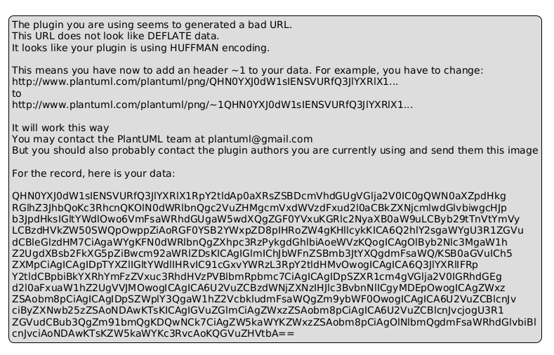
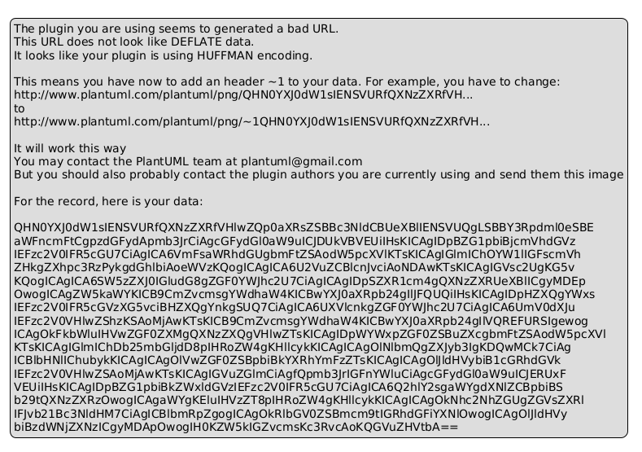

# Activity Diagrams - Rendering Guide

## 📊 Diagrams Included

Hệ thống có **8 Activity Diagrams** cho CRUD operations:

| # | Diagram | Description |
|---|---------|-------------|
| 1 | **CRUD_Create_Ticket** | Tạo ticket sửa chữa với upload ảnh |
| 2 | **CRUD_Read_Ticket** | Lấy danh sách tickets (có filter) |
| 3 | **CRUD_Update_Ticket** | Cập nhật status ticket (Admin) |
| 4 | **CRUD_Delete_Ticket** | Xóa ticket và ảnh đính kèm (Admin) |
| 5 | **CRUD_Asset_Type** | CRUD danh mục tài sản |
| 6 | **CRUD_RoomAsset** | Phân bổ tài sản vào phòng |
| 7 | **CRUD_Announcement** | CRUD thông báo (Admin) |
| 8 | **CRUD_User_Auth** | Register, Login, User Management |

---

## 🎨 Cách Xem Diagrams

### Option 1️⃣: PlantUML Online Editor (Recommended)

1. **Truy cập**: https://www.plantuml.com/plantuml/uml/
2. **Copy nội dung** từ file `visual-paradigm.puml`
3. **Paste** vào editor
4. **Xem diagrams** - Có dropdown chọn diagram
5. **Export**: PNG, SVG, PDF

```
URL: https://www.plantuml.com/plantuml/uml/
File: visual-paradigm.puml
```

---

### Option 2️⃣: VS Code Extension

1. **Install**: "PlantUML" extension (jebbs.plantuml)
2. **Open**: visual-paradigm.puml
3. **Preview**: Alt + D
4. **Right-click** → Export as PNG

```bash
# Install extension
code --install-extension jebbs.plantuml
```

---

### Option 3️⃣: Command Line (Local Installation)

#### macOS
```bash
# Install PlantUML with Homebrew
brew install plantuml

# Render all diagrams
plantuml visual-paradigm.puml -o diagrams

# Render specific diagram
plantuml visual-paradigm.puml -tpng -o diagrams
```

#### Linux (Ubuntu/Debian)
```bash
# Install dependencies
sudo apt-get install -y default-jre graphviz

# Download PlantUML
wget https://sourceforge.net/projects/plantuml/files/plantuml.jar/download -O plantuml.jar

# Render diagrams
java -jar plantuml.jar visual-paradigm.puml -o diagrams
```

#### Docker
```bash
# Using Docker
docker run --rm -v $(pwd):/workspace plantuml/plantuml:latest \
  bash -c "cd /workspace && plantuml visual-paradigm.puml -o diagrams"
```

---

### Option 4️⃣: Node.js Script

```javascript
// install-and-render.js
const fs = require('fs');
const path = require('path');

// Read PlantUML file
const pumlContent = fs.readFileSync('visual-paradigm.puml', 'utf8');

// Extract diagrams
const diagrams = pumlContent.match(/@startuml\s+(\w+).*?@enduml/gs);

console.log('📊 Found diagrams:');
diagrams.forEach((diagram, index) => {
  const name = diagram.match(/@startuml\s+(\w+)/)[1];
  console.log(`  ${index + 1}. ${name}`);
});
```

---

### Option 5️⃣: Online Services

#### Using Kroki (Universal Diagram Service)
```bash
# Convert to PNG using Kroki API
curl -X POST https://kroki.io/plantuml/png \
  -d @visual-paradigm.puml \
  -o diagrams/diagrams.png
```

#### Using Mermaid (Alternative)
```bash
# If you want to convert to Mermaid format
npm install -g @mermaid-js/mermaid-cli
mmdc -i visual-paradigm.puml -o diagrams/diagrams.png
```

---

## 📁 Output Structure

After rendering, you'll have:

```
diagrams/
├── CRUD_Create_Ticket.png
├── CRUD_Read_Ticket.png
├── CRUD_Update_Ticket.png
├── CRUD_Delete_Ticket.png
├── CRUD_Asset_Type.png
├── CRUD_RoomAsset.png
├── CRUD_Announcement.png
├── CRUD_User_Auth.png
└── index.html
```

---

## 🚀 Quick Start

### Fastest Method (Recommended)

1. **Go to**: https://www.plantuml.com/plantuml/uml/

2. **Copy this entire content**:
```plaintext
[Copy content from visual-paradigm.puml]
```

3. **Paste** into the editor

4. **Click Export** → Download PNG

---

## 📊 Diagram Previews

### CRUD_Create_Ticket Flow
```
Student sends request
     ↓
Validate input
     ↓
Check Student exists ✓
     ↓
Process image upload (if any)
     ↓
Validate image format ✓
     ↓
Save to /uploads/tickets/
     ↓
Create Ticket (status=Pending)
     ↓
Return success with image URL
```

### CRUD_Update_Ticket Flow
```
Admin sends PUT request
     ↓
Verify admin role ✓
     ↓
Get Ticket by ID ✓
     ↓
Validate status ✓
     ↓
Update in database
     ↓
Return updated Ticket
```

### CRUD_RoomAsset Flow
```
Admin assigns asset to room
     ↓
Validate data ✓
     ↓
Check if AssetType exists ✓
     ↓
Check if RoomAsset exists
     ├─ Yes: Update quantity/condition
     └─ No: Create new RoomAsset
     ↓
Save to database
     ↓
Return success
```

---

## 🎯 Usage Examples

### Render Single Diagram
```bash
# Extract and render one diagram
cat > /tmp/single.puml << 'EOF'
@startuml CRUD_Create_Ticket
[diagram content]
@enduml
EOF

plantuml /tmp/single.puml -o diagrams
```

### Render All with Settings
```bash
# High quality PNG
plantuml visual-paradigm.puml -o diagrams -Djava.awt.headless=true

# SVG format (vector)
plantuml visual-paradigm.puml -tsvg -o diagrams

# PDF format
plantuml visual-paradigm.puml -tpdf -o diagrams
```

---

## 📋 Integration with Documentation

### In Markdown
```markdown

```

### In README
```markdown
## Activity Diagrams

### Ticket Management Flow


### Asset Management

```

---

## 🔧 Troubleshooting

### Issue: "PlantUML not found"
```bash
# Solution: Install Java first
java -version  # Check Java installation

# Then install PlantUML
brew install plantuml  # macOS
apt install plantuml   # Linux
```

### Issue: "Cannot connect to display"
```bash
# Solution: Use headless mode
plantuml -Djava.awt.headless=true visual-paradigm.puml -o diagrams
```

### Issue: "Encoding error"
```bash
# Solution: Specify UTF-8 encoding
plantuml -charset UTF-8 visual-paradigm.puml -o diagrams
```

---

## 📚 Learn More

- **PlantUML Docs**: https://plantuml.com/
- **Activity Diagram Guide**: https://plantuml.com/activity-diagram-beta
- **Online Editor**: https://www.plantuml.com/plantuml/uml/

---

## ✨ Files Included

- **visual-paradigm.puml** - Source file with all diagrams
- **render_diagrams.sh** - Shell script to guide rendering
- **render_diagrams.py** - Python script for batch rendering
- **diagrams/index.html** - Interactive viewer guide

---

## 🎓 Summary

| Method | Ease | Quality | Speed |
|--------|------|---------|-------|
| Online Editor | ⭐⭐⭐⭐⭐ | ⭐⭐⭐⭐ | ⭐⭐⭐⭐⭐ |
| VS Code Extension | ⭐⭐⭐⭐ | ⭐⭐⭐⭐⭐ | ⭐⭐⭐⭐ |
| Command Line | ⭐⭐ | ⭐⭐⭐⭐⭐ | ⭐⭐⭐ |
| Docker | ⭐⭐⭐ | ⭐⭐⭐⭐⭐ | ⭐⭐ |

**Recommended**: Use PlantUML Online Editor for quickest results! 🚀
