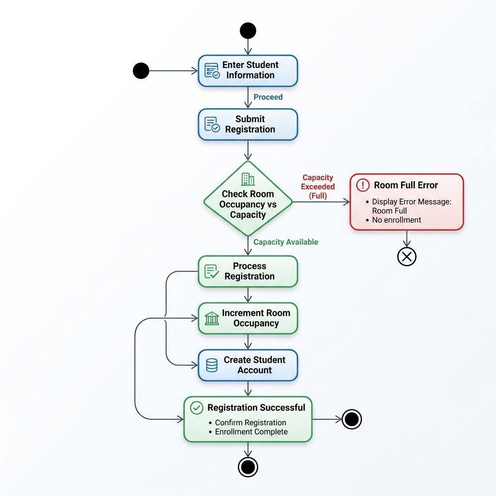
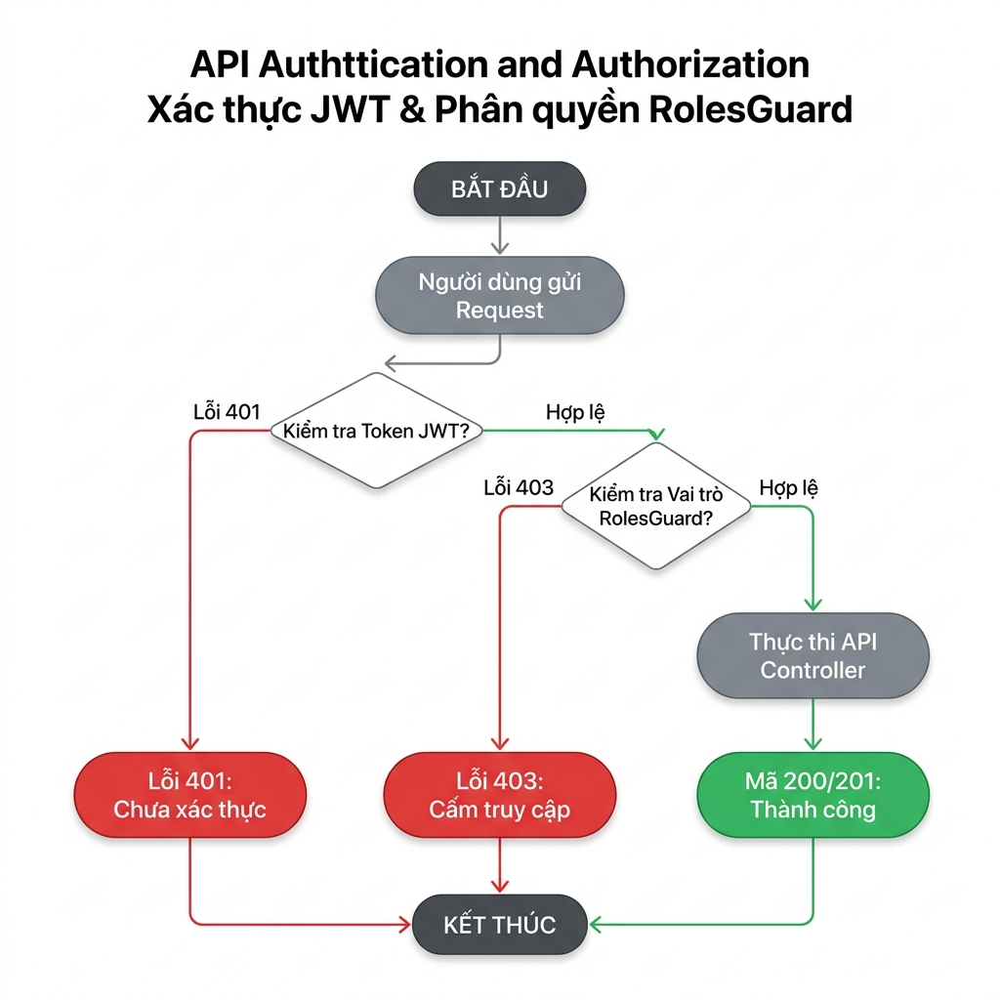
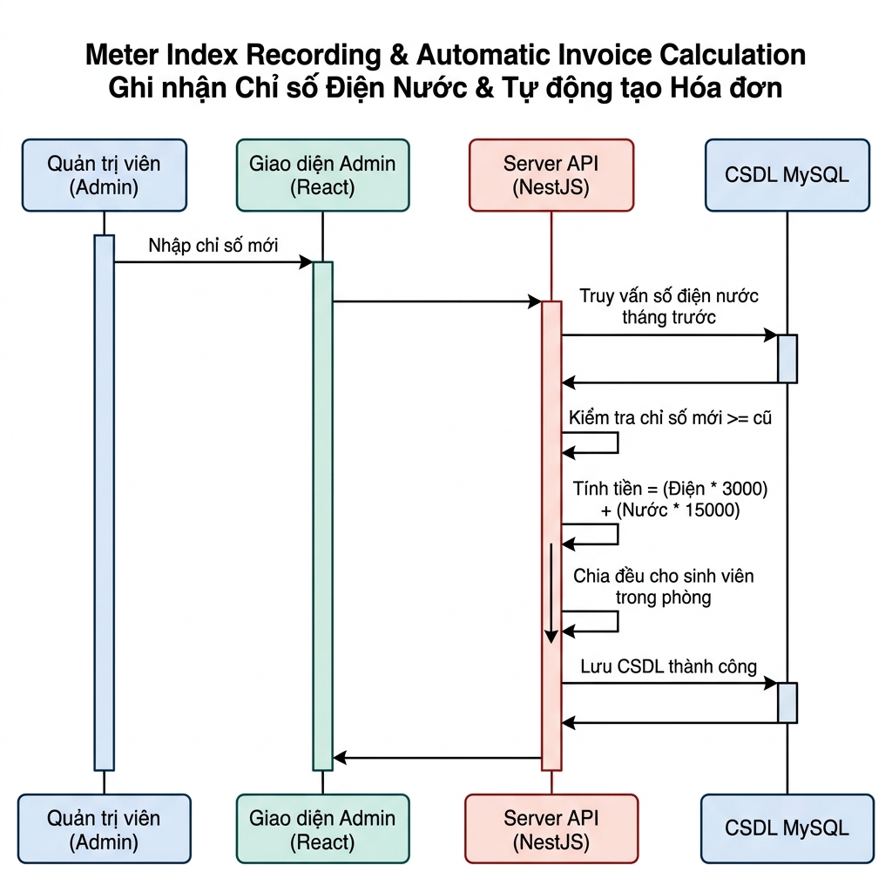
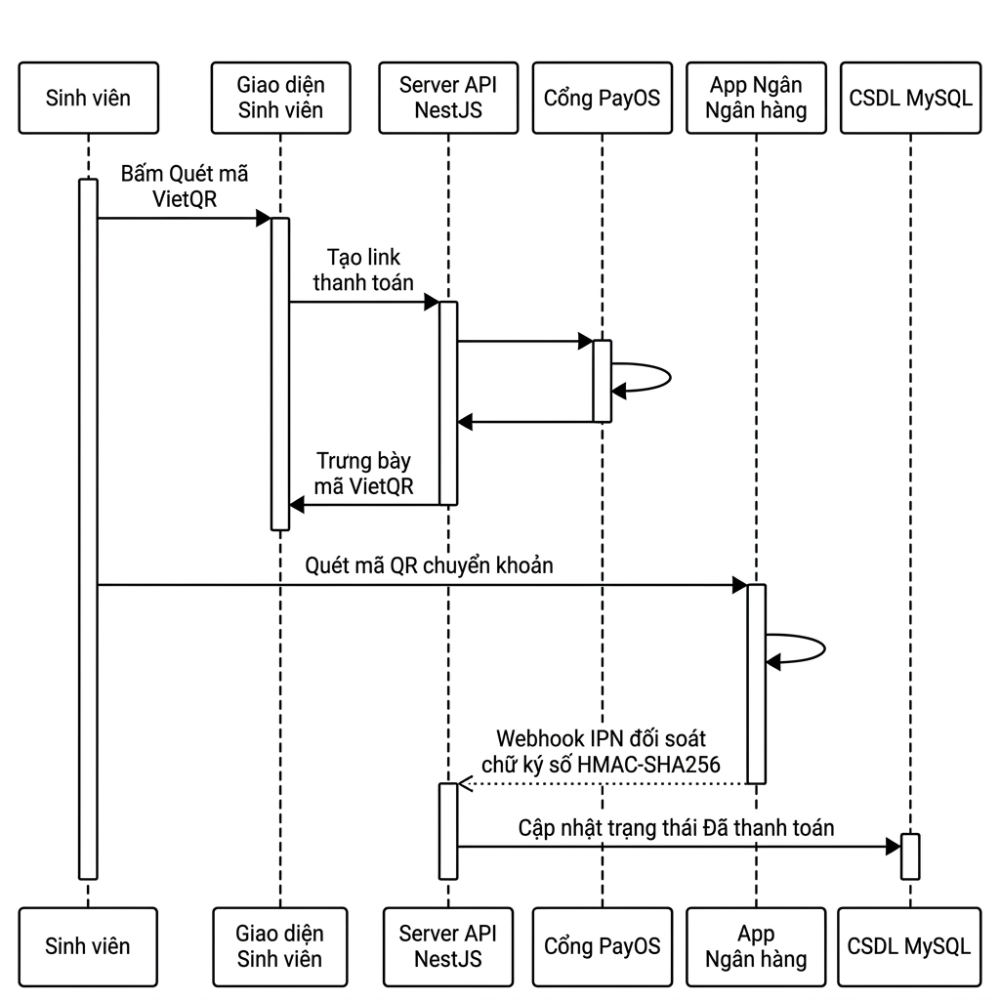
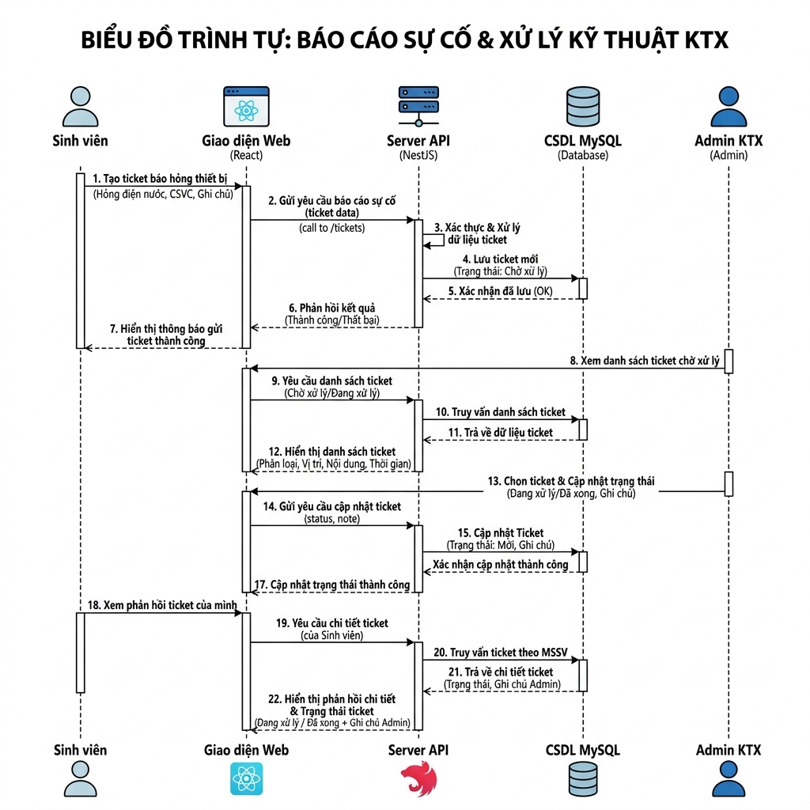

<h1 align="center">🏢 Ứng Dụng Quản Lý Ký Túc Xá (Dormitory Management System)</h1>

<p align="center">
  📚 <strong>Advanced Web Development Project</strong> – Nhóm: <code>DomitoryManagement_Group</code><br>
  🎓 Môn học: Xây Dựng Và Phát Triển Web Nâng Cao<br>
  🏫 Trường: Đại Học Phenikaa<br>
  📅 Học kỳ III Năm học 2024-2025
</p>

---

## 📑 Mục lục
1. 📖 Giới thiệu dự án
2. 🎯 Mục tiêu và phạm vi
3. ⚙️ Yêu cầu chức năng & User Stories
4. 🏗️ Phân tích và thiết kế kiến trúc hệ thống
   - 4.1. 📦 Các thực thể chính (Entities)
   - 4.2. 🔗 Mối quan hệ giữa các thực thể
5. 💡 Các công nghệ & kỹ thuật Web nâng cao áp dụng
6. 📊 Sơ đồ Thiết kế Hệ thống
   - 6.1. 📐 Class Diagram (UML)
   - 6.2. 🔁 Activity Diagrams (05 Quy trình nghiệp vụ)
7. 🗂️ Cấu trúc thư mục & mô tả file quan trọng
8. ▶️ Hướng dẫn cài đặt và chạy chương trình
   - 8.1. Chạy Backend (NestJS Server)
   - 8.2. Chạy Frontend (React SPA Client)
9. 🧪 Test & Xử lý ngoại lệ (Validation & Exceptions)
10. 🚀 Chế độ Thanh toán PayOS Sandbox & Hướng phát triển
11. 👨‍👩‍👧‍👦 Thành viên nhóm
12. 📚 Link Repository & Tài liệu

---

## 1. 📌 Giới thiệu dự án

🎯 Đây là ứng dụng Web full-stack mô phỏng hệ thống quản lý cư trú tập trung trong Ký túc xá Đại học Phenikaa, nơi người dùng có thể:
- 🏢 Quản lý **Tòa nhà & Phòng ở** (sức chứa `capacity`, số người hiện tại `current_occupancy`, loại phòng, giá thuê cố định).
- 👨‍🎓 Quản lý **Sinh viên nội trú & Hợp đồng cư trú** (MSSV, CCCD, Lớp, Quê quán, phân phòng, duyệt xếp chỗ).
- ⚡💧 Ghi nhận **Chỉ số Điện Nước** hàng tháng & tự động tính toán chia đều hóa đơn cho các thành viên trong phòng.
- 💳 **Thanh toán trực tuyến VietQR (PayOS)** với chữ ký số HMAC-SHA256 đối soát Webhook IPN tự động & chế độ Demo Sandbox cho bài tập lớn.
- 🛠️ Quản lý **Tài sản & Báo cáo sự cố (Ticket System)** kỹ thuật trong phòng ở.
- 📢 Bảng tin **Thông báo hành chính** KTX với bộ lọc tìm kiếm thời gian thực.

🔧 Dự án được phát triển theo kiến trúc **Full-stack Decoupled (Client - Server)**:
- **Backend**: NestJS (Node.js framework), RESTful API, TypeORM, MySQL Cloud (Aiven SSL), JWT Auth, RolesGuard (RBAC), Bcrypt hashing.
- **Frontend**: React (TypeScript), Bootstrap 5, Bootstrap Icons, Single Page Application (SPA).

---

## 2. 🎯 Mục tiêu và phạm vi

- 🏠 **Quản lý phòng ở**: Thêm, sửa, xóa tòa nhà/phòng ở, kiểm soát sức chứa tối đa.
- 👨‍🎓 **Quản lý cư trú**: Đăng ký tài khoản sinh viên, duyệt/từ chối yêu cầu xếp phòng, quản lý hợp đồng.
- ⚡ **Quản lý Điện Nước & Hóa đơn**: Chốt số điện nước cuối tháng, tính tiền theo công thức đơn giá, tự động chia đều hóa đơn.
- 💳 **Thanh toán trực tuyến**: Tạo mã VietQR động PayOS, tự động cập nhật trạng thái "Đã thanh toán" qua Webhook.
- 🛠️ **Hệ thống Ticket**: Tiếp nhận & xử lý báo cáo sự cố hỏng hóc thiết bị KTX.

---

## 3. ⚙️ Yêu cầu chức năng & User Stories

### 👨‍💼 Quản trị viên (Admin):
- ➕➖ CRUD Tòa nhà, Phòng ở, Tài sản KTX.
- 📋 Duyệt hoặc Từ chối sinh viên đăng ký xếp phòng.
- ⚡ Nhập chỉ số điện nước hàng tháng, tự động tính tiền và phát hành hóa đơn.
- 🛠️ Cập nhật tiến độ xử lý Ticket báo sự cố (`pending` -> `processing` -> `completed`).

### 👨‍🎓 Sinh viên (Student):
- 📝 Đăng ký tài khoản trực tuyến & chọn phòng ở còn trống.
- 💳 Tra cứu hóa đơn phòng mình & Bấm nút "Quét mã VietQR" để thanh toán trực tuyến.
- 🛠️ Tạo ticket báo cáo hỏng hóc thiết bị trong phòng.
- 📢 Xem bảng tin thông báo hành chính KTX.

---

## 4. 🏗️ Phân tích và thiết kế kiến trúc hệ thống

### 4.1. 🧱 Thực thể chính (Entities)

| 📦 Entity | 📝 Mô tả chức năng |
| :--- | :--- |
| `Building` | Quản lý tòa nhà KTX: mã tòa, tên tòa, mô tả. |
| `Room` | Quản lý phòng ở: thuộc tòa nhà nào, sức chứa tối đa (`capacity`), số người hiện tại (`current_occupancy`), giá phòng cố định. |
| `User` | Lưu tài khoản & hồ sơ sinh viên: username, password (bcrypt), email, role (`admin`/`student`), room_id, mssv, cccd, phone, hometown, class_name. |
| `Contract` | Quản lý hợp đồng cư trú sinh viên theo thời hạn. |
| `UtilityMeter` | Ghi nhận chỉ số điện & nước mới hàng tháng theo từng phòng. |
| `Invoice` | Hóa đơn tài chính: tiền phòng + tiền điện + tiền nước, mã đơn hàng PayOS, trạng thái `unpaid`/`paid`. |
| `Asset` / `RoomAsset` | Danh mục thiết bị KTX & phân bổ thiết bị kèm trạng thái vào từng phòng. |
| `Ticket` | Báo cáo sự cố hỏng hóc thiết bị: mức độ khẩn cấp (Low/Medium/High), trạng thái xử lý, ghi chú Admin. |

### 4.2. 🔗 Mối quan hệ giữa các thực thể
- `Building` 1 ── N `Room`
- `Room` 1 ── N `User` (Sức chứa `current_occupancy <= capacity`)
- `Room` 1 ── N `UtilityMeter`
- `Room` 1 ── N `Invoice`
- `User` 1 ── N `Invoice`
- `UtilityMeter` 1 ── 1 `Invoice`
- `Room` 1 ── N `RoomAsset`
- `Room` 1 ── N `Ticket`

---

## 5. 💡 Các công nghệ & kỹ thuật Web nâng cao áp dụng

- 🔐 **Xác thực JWT Stateless**: Cấp phát Token JWT có hạn dùng 24h, bảo vệ API với `JwtAuthGuard`.
- 🛡️ **Phân quyền RBAC**: `RolesGuard` & Decorator `@Roles('admin')` chặn sinh viên gọi API Admin (Lỗi 403 Forbidden).
- 🔒 **Băm mật khẩu Bcrypt**: Mã hóa mật khẩu với Salt Round = 10.
- 🌐 **Kết nối Database SSL/TLS**: Kết nối MySQL Cloud (Aiven) mã hóa an toàn.
- 💳 **Cổng VietQR PayOS & HMAC-SHA256**: Sinh mã QR động Napas247, xác thực chữ ký Webhook IPN chống giả mạo giao dịch & Chế độ Demo Sandbox bài tập lớn.
- 🗄️ **TypeORM Parameterized Queries**: Ngăn ngừa hoàn toàn lỗ hổng SQL Injection.

---

## 6. 📊 Sơ đồ Thiết kế Hệ thống

### 6.1. 📐 Class Diagram (UML)


---

### 6.2. 🔁 Activity Diagrams (05 Quy trình nghiệp vụ)

#### Sơ đồ 1: Quy trình Đăng ký Sinh viên & Kiểm tra Sức chứa Phòng


#### Sơ đồ 2: Quy trình Xác thực JWT & Phân quyền RolesGuard


#### Sơ đồ 3: Quy trình Ghi số Điện Nước & Tự động Chia đều Hóa đơn


#### Sơ đồ 4: Quy trình Thanh toán VietQR PayOS & Webhook IPN


#### Sơ đồ 5: Quy trình Báo cáo Sự cố Ticket System & Xử lý Kỹ thuật


---

## 7. 🗂️ Cấu trúc thư mục

```text
DomitoryManagement/
├── client/                      # Frontend Single Page Application (React + TypeScript)
│   ├── src/
│   │   ├── components/          # React Components (AdminDashboard, StudentBilling, Tickets...)
│   │   ├── App.tsx              # Main App & Router Navigation
│   │   └── main.tsx             # Entry Point
│   ├── package.json
│   └── tsconfig.json
│
├── server/                      # Backend RESTful API Server (NestJS + TypeORM)
│   ├── src/
│   │   ├── auth/                # Auth Module (JWT, Register, Login, RolesGuard)
│   │   ├── users/               # Users Module & Student Management
│   │   ├── rooms/               # Rooms & Buildings Module
│   │   ├── invoices/            # Billing Module & PayOS VietQR Integration
│   │   ├── assets/              # Assets & Room Asset Allocations
│   │   ├── tickets/             # Ticket System Module
│   │   ├── announcements/       # Announcements Module
│   │   └── database/            # Database Providers & SSL MySQL Configuration
│   ├── .env                     # Server Environment Variables
│   └── package.json
│
└── diagrams/                    # Hệ thống hình ảnh sơ đồ UML & Activity Diagrams
    ├── class_diagram_vi.png
    └── activitydiagrams/
        ├── activity_1_dang_ky_phong.png
        ├── activity_2_xac_thuc_jwt.png
        ├── activity_3_ghi_so_dien_nuoc.png
        ├── activity_4_thanh_toan_payos.png
        └── activity_5_bao_cao_su_co.png
```

---

## 8. ▶️ Hướng dẫn cài đặt và chạy chương trình

### 8.1. Chạy Backend (NestJS Server)
1. Di chuyển vào thư mục `server`:
   ```bash
   cd server
   ```
2. Cài đặt dependencies:
   ```bash
   npm install --legacy-peer-deps
   ```
3. Cấu hình file `.env` kết nối CSDL MySQL & PayOS.
4. Chạy server ở chế độ Development:
   ```bash
   npm run start:dev
   ```
   => Backend API lắng nghe tại: `http://localhost:3000/api`

---

### 8.2. Chạy Frontend (React Client)
1. Mở cửa sổ Terminal mới và di chuyển vào thư mục `client`:
   ```bash
   cd client
   ```
2. Cài đặt dependencies:
   ```bash
   npm install
   ```
3. Chạy giao diện Web:
   ```bash
   npm run dev
   ```
   => Giao diện Web hiển thị tại: `http://localhost:5173`

---

## 9. 🧪 Test & Xử lý ngoại lệ (Validation & Exceptions)

- **Input Validation**: Tự động chặn dữ liệu lỗi qua `ValidationPipe` (Mã 400 Bad Request).
- **Unique Constraint Check**: Kiểm tra trùng lặp Username, Email, MSSV, CCCD (Mã 409 Conflict).
- **Unit Tests**:
  - `auth.service.spec.ts`: Kiểm tra băm Bcrypt & cấp JWT Token.
  - `invoices.service.spec.ts`: Kiểm tra công thức tính toán điện nước & chia đều tiền phòng.

---

## 10. 🚀 Chế độ Thanh toán PayOS Sandbox & Hướng phát triển

- 💳 **PayOS Integration**: Tự động chuyển đổi sang **Chế độ Demo Sandbox** nếu chìa khóa API chưa kích hoạt, giúp thuyết minh bài tập lớn mượt mà không bị ngắt quãng.
- 📱 **Hướng phát triển**: Mở rộng ứng dụng di động (React Native), điểm danh sinh viên bằng AI nhận diện khuôn mặt, tích hợp thông báo qua Zalo/Email.

---

## 👨‍👩‍👧‍👦 Thành viên nhóm

| Tên thành viên | Mã SV | Vai trò đóng góp | % Đóng góp | GitHub |
| :--- | :--- | :--- | :---: | :--- |
| 🧑‍💻 **Trần Thị Quỳnh** | 24104502 | **Trưởng nhóm** — Core Auth (JWT/Bcrypt/RolesGuard), Invoices Service, PayOS VietQR Integration, UI Login & Announcements, Unit Tests | **35%** | [@wyn0502](https://github.com/wyn0502) |
| 👨‍💻 **Lê Văn Đông** | 24107720 | **Thành viên** — Module CRUD Tòa nhà & Phòng ở, Sơ đồ xếp chỗ sinh viên, Hợp đồng cư trú KTX | **33%** | [@donglevan](https://github.com/wyn0502) |
| 👨‍💻 **Nguyễn Văn Long** | 24107665 | **Thành viên** — Module Tài sản, Ticket System báo cáo sự cố & Bảng tin thông báo | **32%** | [@longnguyen](https://github.com/wyn0502) |

---

## 🔗 Link Repository & Tài liệu

📂 **Source Code GitHub:**  
👉 [`github.com/wyn0502/DomitoryManagement`](https://github.com/wyn0502/DomitoryManagement)

💡 **Nếu bạn thấy dự án hữu ích, hãy nhấn 🌟 Star để ủng hộ nhóm nhé!**
