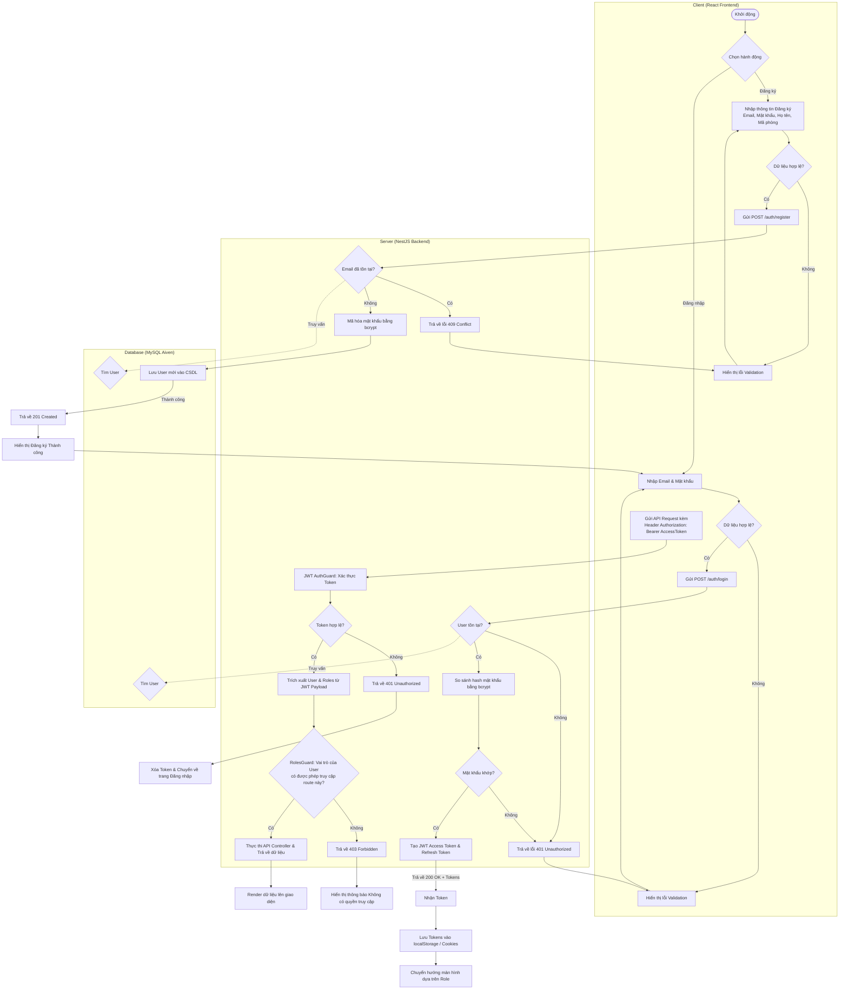
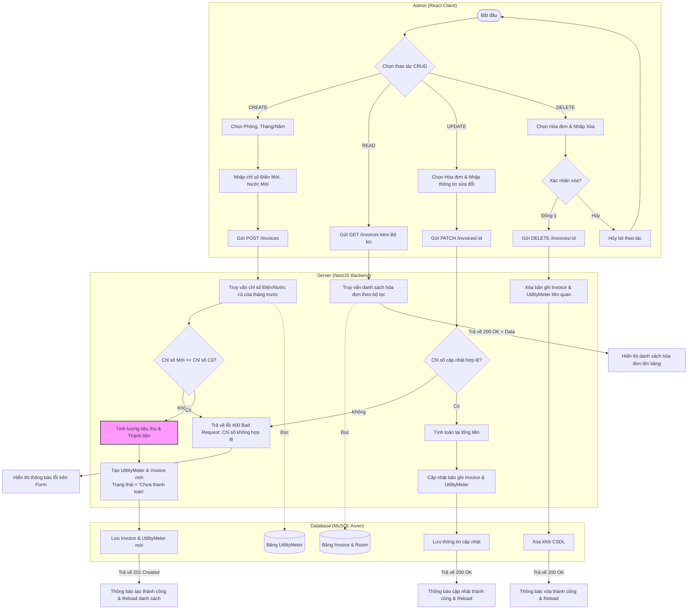
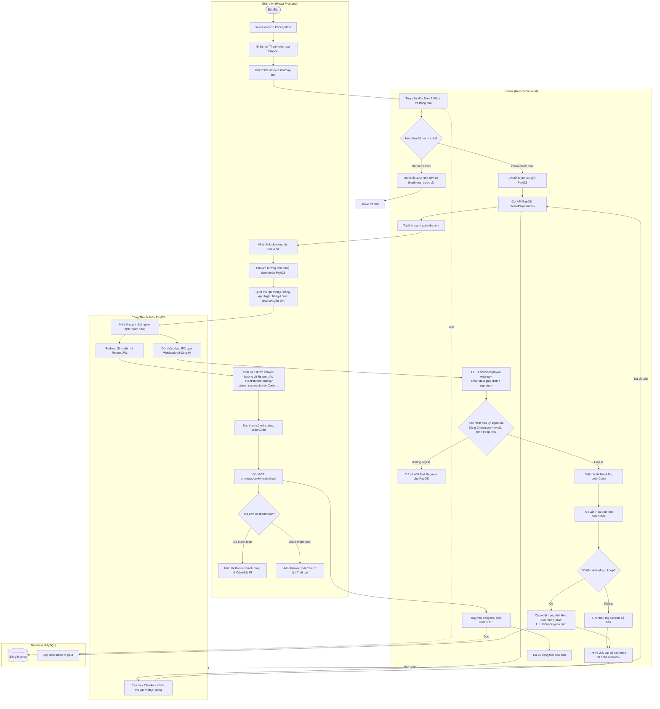

# Sơ Đồ Hoạt Động (Activity Diagrams) - Quỳnh (SV1)

Tài liệu này chứa các sơ đồ hoạt động (Activity Diagrams) chi tiết cho các nhiệm vụ của **Quỳnh (SV1 - Trưởng nhóm)**, bao gồm:
1. **Quản lý Xác thực & Phân quyền** (Đăng ký, Đăng nhập, RolesGuard chặn truy cập theo vai trò).
2. **Quản lý Chỉ số Điện Nước & Hóa đơn** (Quy trình CRUD của Admin).
3. **Quy trình Thanh toán Tự động tích hợp Cổng thanh toán PayOS (VietQR)** (Quy trình tạo link thanh toán, quét mã QR ngân hàng, xử lý Webhook IPN, và cập nhật trạng thái hóa đơn).

---

## 1. Quy Trình Xác Thực & Phân Quyền (Auth & RolesGuard)

Quy trình này mô tả hoạt động từ lúc người dùng đăng ký tài khoản, đăng nhập hệ thống, cho đến khi gửi yêu cầu truy cập các API được bảo vệ bởi `RolesGuard`.

---

## 2. Quy Trình Quản Lý Chỉ Số Điện Nước & Hóa Đơn (CRUD - Admin)

Quy trình này mô tả các hoạt động của Quản trị viên (Admin) khi thực hiện tạo mới, xem, sửa đổi, và xóa các hóa đơn cũng như chỉ số điện nước của từng phòng.

---

## 3. Quy Trình Thanh Toán Hóa Đơn Tích Hợp PayOS (VietQR)

Đây là quy trình chi tiết nhất, mô tả sự tương tác giữa **Sinh viên (React)**, **Hệ thống Backend (NestJS)**, và **Cổng thanh toán PayOS** thông qua các bước khởi tạo link thanh toán, quét mã QR VietQR, xử lý Webhook xác thực (IPN) an toàn bằng chữ ký bảo mật, và phản hồi trạng thái thanh toán theo thời gian thực.

---

## 4. Đặc Điểm Kỹ Thuật Quan Trọng Khi Tích Hợp PayOS

Khi phát triển và tích hợp cổng thanh toán PayOS trên thực tế, Quỳnh (SV1) cần đặc biệt lưu ý các quy tắc nghiệp vụ sau để tránh lỗi giao dịch:

1. **Kiểu dữ liệu của Mã Đơn Hàng (`orderCode`)**:
   - PayOS chỉ chấp nhận `orderCode` dưới dạng **số nguyên (integer)** (ví dụ: `17812903`). Không được gửi chuỗi UUID hoặc ký tự không thuộc kiểu số.
   - Giải pháp: Sử dụng chính ID tự tăng của bảng `Invoice` trong Database làm `orderCode`, hoặc kết hợp với thời gian hiện tại (`Number(new Date().getTime().toString().slice(-8))`) để đảm bảo tính duy nhất.

2. **Mô tả Giao dịch (`description`)**:
   - Độ dài tối đa **25 ký tự**.
   - Chỉ được chứa chữ cái không dấu, số, dấu cách (không có ký tự đặc biệt hay dấu tiếng Việt).
   - Ví dụ hợp lệ: `Thanh toan tien phong 101` (độ dài 24 ký tự).

3. **Bảo mật Webhook (IPN Signature)**:
   - Tất cả dữ liệu webhook gửi từ PayOS đều kèm theo chữ ký bảo mật. Backend bắt buộc phải dùng `Checksum Key` được cung cấp trong dashboard PayOS để giải mã/xác thực tính toàn vẹn của dữ liệu trước khi cập nhật trạng thái hóa đơn trong database.
